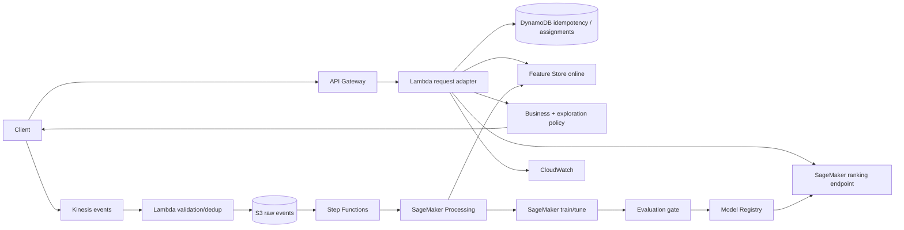

# Real-Time Personalized Decisioning on AWS

A local-first, production-shaped multi-stage recommendation platform: hybrid candidate retrieval, contextual learning-to-rank, value-aware decisioning, controlled exploration, experimentation, feedback logging, and an optional AWS deployment path.

`event → retrieve → point-in-time features → rank → policy/rules → Top-K → exposure/outcome log`

**ML:** collaborative SVD + popularity retrieval · graded tree ranker · IPS debiasing · NDCG/MAP/MRR/Recall@K · epsilon-greedy  
**Platform:** FastAPI · Pydantic · SageMaker · Feature Store · Kinesis · Lambda/API Gateway · DynamoDB · S3 · Step Functions · CloudWatch · ECR · Terraform

## Quick start

Python 3.11+ is required. Generated data and reported metrics are deterministic for seed 42.

```bash
make setup
make demo
make serve
curl -X POST http://localhost:8000/v1/recommendations -H "Content-Type: application/json" -d '{"user_id":"u00001","k":5,"context":{"device":"mobile","hour":20,"location_category":"urban","session_depth":2}}'
```

Individual stages are `make data`, `make train`, `make evaluate`, and `make test`. The demo creates 500 users, 300 items, 20,000 temporally ordered interactions, trains retrieval and ranking, evaluates the holdout, returns recommendations, and simulates exploration.

## Architecture



The online Lambda is intentionally thin: authenticate/validate, retrieve candidates and online features, invoke SageMaker, apply bounded policies, log the exposure, and serialize the response. Training orchestration is batch; Kinesis processing is streaming. See [system design](docs/architecture/system-design.md) and [ADRs](docs/decisions/).

## ML design

Synthetic behavior comes from hidden user/item factors, category preference, price fit, quality, context, and biased popularity exposure. Labels are graded: impression 0, click 1, conversion 3. No feature directly contains the target. A temporal 80/20 split avoids future leakage.

Candidate generation is distinct from ranking:

- popularity is robust for cold start;
- collaborative truncated SVD captures personalized implicit-feedback structure;
- a hybrid union improves coverage and exposes retrieval scores to ranking.

The contextual gradient-boosted ranker predicts graded utility within each request. It is trained with inverse exposure-propensity weights. The decision score is:

`0.65 × relevance + 0.20 × conversion propensity + 0.15 × normalized expected value`

Unavailable items are removed before Top-K. Treatment traffic uses epsilon-greedy ordering and logs the action probability; control is deterministic. Exploration is suitable when uncertainty and feedback starvation matter, but should be constrained or disabled for regulated, safety-critical, or high-cost decisions.

Metrics are written to `artifacts/metrics.json`; the README deliberately does not claim numbers before they are reproduced. Ranking uses NDCG@10, MAP@10, MRR, Precision@10, and Recall@10. Retrieval uses Recall@50.

## Experimentation and feedback loops

SHA-256 bucketing provides stable user-level control/treatment assignment. Exposure and outcome contracts contain experiment, assignment, request, rank, and propensity. Offline analysis includes confidence intervals, two-sided significance, relative/absolute effect, SRM detection, and power-based sample sizing.

Recommendations change exposure, so naive retraining amplifies position and popularity bias. The system logs impressions and propensities, uses inverse-propensity weights, and preserves raw append-only events. Production analysis must also guard against peeking, multiple testing, selection bias, novelty effects, interference, and experiment contamination.

## Feature consistency

`LocalFeatureStore` mirrors the online contract; SageMaker Feature Store is the cloud adapter target. Offline event aggregates are strictly prior to each event. Feature definitions and schema versions should be promoted with models. Production alarms cover freshness, null/range checks, skew, and drift. Offline snapshots go to S3; low-latency current values go to the online store.

## API

`POST /v1/recommendations` returns a UUID request ID, model version, experiment assignment, UTC timestamp, candidates examined, policy metadata, ranked item IDs, total and component scores, and a concise reason. `POST /v1/events` is idempotent locally; DynamoDB conditional writes provide durable cloud idempotency. DynamoDB is used for small mutable low-latency state—not history or training data, which belongs in S3/Feature Store.

## AWS lifecycle

Terraform environments provision encrypted S3, Kinesis, DynamoDB, ECR, IAM, CloudWatch, API Gateway, Lambda, and Step Functions primitives. SageMaker projects/pipelines use Processing for validation/features, training/tuning, evaluation, Registry registration, and endpoint deployment. An evaluation condition (`NDCG@10 >= configured baseline`, plus data-quality checks) blocks registration. Dev auto-deploys approved candidates; staging runs integration/load tests; production requires protected-environment approval and canary rollout.

```bash
cd infrastructure/terraform/environments/dev
terraform init
terraform plan -var='project=decision-platform' -out=tfplan
terraform apply tfplan
# when finished: terraform destroy
```

AWS execution needs credentials, artifact bucket inputs, packaged Lambda/model images, and an approved model. Normal CI needs none. GitHub OIDC is recommended; long-lived access keys are not.

## Operations, security, and cost

CloudWatch covers API p50/p95/p99 latency, volume, 4xx/5xx, throttles, endpoint errors, and score distributions. Batch monitors track schema/range validity, freshness, drift, candidate recall, catalog coverage, intra-list category diversity, popularity concentration, and delayed outcome performance. Correlate with request/model/experiment IDs; exclude raw PII.

Encryption is enabled at rest and in transit; buckets block public access; IAM scopes actions to named resources. Production should use a private SageMaker endpoint/VPC endpoints, WAF and JWT/IAM authentication, KMS customer-managed keys where required, Secrets Manager/SSM for secrets, CloudTrail, retention policies, and PII tokenization. `.env.example` contains no secrets.

Primary cost drivers are always-on SageMaker endpoints, Feature Store online writes/storage, Kinesis shards, and retained logs. Dev should use on-demand DynamoDB, short retention, small/serverless inference or endpoint schedules, lifecycle S3 data to cheaper tiers, and set budgets. Exact costs vary by region and traffic and are intentionally not fabricated.

## Repository map

```text
src/decision_platform/{data,features,retrieval,ranking,policies,experimentation,
                       training,serving,monitoring,cloud}
tests/{unit,integration}     configs/       scripts/
docs/{architecture,decisions}              infrastructure/terraform/
.github/workflows/           Dockerfile     Makefile
```

## Quality gates

`make lint`, `make typecheck`, `make test`, and `make security` run locally. CI adds coverage, dependency audit, Docker build, Terraform formatting/validation, and credential-free pipeline checks. Deployment workflows are environment protected and use GitHub OIDC.

## Limitations and next steps

The local ranker uses graded pointwise boosting rather than a native pairwise objective to keep installation portable; the SageMaker image can substitute XGBoost `rank:ndcg` behind the same interface. Collaborative retrieval materializes scores and is not intended for billion-item catalogs; use ANN embeddings/OpenSearch or a managed vector index at that scale. The sample Terraform defines coherent secure primitives but account-specific networking, DNS, WAF, alarms, quotas, and packaged artifacts require organizational inputs. Offline policy evaluation beyond IPS (doubly robust estimators), delayed conversions, fairness constraints, multi-objective calibration, and canary automation are natural production extensions.

